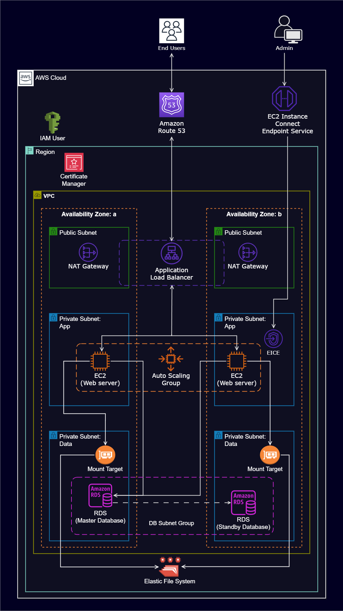

# Il Mio Progetto  
**PROGETTO AWS:** Deployment e hosting di un'applicazione WordPress ad alta disponibilità utilizzando EC2, RDS, Route 53, ASG e VPC

---

# Hosting di un sito WordPress su AWS

Questo repository contiene le risorse e gli script utilizzati per effettuare il deployment di un sito WordPress su Amazon Web Services (AWS). Il progetto sfrutta diversi servizi AWS per garantire alta disponibilità, scalabilità e sicurezza all'applicazione WordPress.

## Panoramica dell’Architettura

Il sito WordPress è ospitato su istanze EC2 all’interno di un’architettura altamente disponibile e sicura che include:

- Una Virtual Private Cloud (VPC) con subnet pubbliche e private distribuite su due Availability Zones (AZ) per tolleranza ai guasti e alta disponibilità.
- Un Internet Gateway per permettere la comunicazione tra le istanze nella VPC e Internet.
- Security Group che agiscono come firewall virtuali per controllare il traffico in entrata e uscita.
- Subnet pubbliche usate per il NAT Gateway e l’Application Load Balancer, per facilitare l’accesso esterno e il bilanciamento del carico.
- Subnet private per i server web per aumentare la sicurezza.
- EC2 Instance Connect Endpoint per accesso SSH sicuro.
- Un Application Load Balancer con un target group per distribuire il traffico web tra più istanze EC2.
- Un Auto Scaling Group per regolare automaticamente il numero di istanze EC2 in base al traffico, garantendo scalabilità e resilienza.
- Amazon RDS come servizio gestito per il database relazionale.
- Amazon EFS per uno storage di file scalabile ed elastico.
- AWS Certificate Manager per la gestione di certificati SSL/TLS.
- AWS Simple Notification Service (SNS) per notifiche relative all’attività del gruppo di Auto Scaling.
- Amazon Route 53 per la registrazione di nomi di dominio e la gestione DNS.

## Script di Deployment

### Script di Installazione di WordPress

Questo script viene utilizzato per la configurazione iniziale dell'applicazione WordPress su un’istanza EC2. Include i passaggi per installare Apache, PHP, MySQL e per montare Amazon EFS sull’istanza.

```bash
# create to root user
sudo su

# update the software packages on the ec2 instance 
sudo yum update -y

# create an html directory 
sudo mkdir -p /var/www/html

# environment variable
EFS_DNS_NAME=fs-064e9505819af10a4.efs.us-east-1.amazonaws.com

# mount the efs to the html directory 
sudo mount -t nfs4 -o nfsvers=4.1,rsize=1048576,wsize=1048576,hard,timeo=600,retrans=2,noresvport "$EFS_DNS_NAME":/ /var/www/html

# install the apache web server, enable it to start on boot, and then start the server immediately
sudo yum install -y httpd
sudo systemctl enable httpd 
sudo systemctl start httpd

# install php 8 along with several necessary extensions for wordpress to run
sudo dnf install -y \
php \
php-cli \
php-cgi \
php-curl \
php-mbstring \
php-gd \
php-mysqlnd \
php-gettext \
php-json \
php-xml \
php-fpm \
php-intl \
php-zip \
php-bcmath \
php-ctype \
php-fileinfo \
php-openssl \
php-pdo \
php-tokenizer

# install the mysql version 8 community repository
sudo wget https://dev.mysql.com/get/mysql80-community-release-el9-1.noarch.rpm 
#
# install the mysql server
sudo dnf install -y mysql80-community-release-el9-1.noarch.rpm 
sudo rpm --import https://repo.mysql.com/RPM-GPG-KEY-mysql-2023
sudo dnf repolist enabled | grep "mysql.*-community.*"
sudo dnf install -y mysql-community-server 
#
# start and enable the mysql server
sudo systemctl start mysqld
sudo systemctl enable mysqld

# set permissions
sudo usermod -a -G apache ec2-user
sudo chown -R ec2-user:apache /var/www
sudo chmod 2775 /var/www && find /var/www -type d -exec sudo chmod 2775 {} \;
sudo find /var/www -type f -exec sudo chmod 0664 {} \;
chown apache:apache -R /var/www/html 

# download wordpress files
wget https://wordpress.org/latest.tar.gz
tar -xzf latest.tar.gz
sudo cp -r wordpress/* /var/www/html/

# create the wp-config.php file
sudo cp /var/www/html/wp-config-sample.php /var/www/html/wp-config.php

# edit the wp-config.php file
sudo vi /var/www/html/wp-config.php

# restart the webserver
sudo service httpd restart
```

### Script per il Template di Lancio dell’Auto Scaling Group

Questo script è incluso nel launch template dell’Auto Scaling Group, per garantire che le nuove istanze siano configurate correttamente con i software e le impostazioni necessarie.

```bash
#!/bin/bash
# update the software packages on the ec2 instance 
sudo yum update -y

# install the apache web server, enable it to start on boot, and then start the server immediately
sudo yum install -y httpd
sudo systemctl enable httpd 
sudo systemctl start httpd

# install php 8 along with several necessary extensions for wordpress to run
sudo dnf install -y \
php \
php-cli \
php-cgi \
php-curl \
php-mbstring \
php-gd \
php-mysqlnd \
php-gettext \
php-json \
php-xml \
php-fpm \
php-intl \
php-zip \
php-bcmath \
php-ctype \
php-fileinfo \
php-openssl \
php-pdo \
php-tokenizer

# install the mysql version 8 community repository
sudo wget https://dev.mysql.com/get/mysql80-community-release-el9-1.noarch.rpm 
#
# install the mysql server
sudo dnf install -y mysql80-community-release-el9-1.noarch.rpm 
sudo rpm --import https://repo.mysql.com/RPM-GPG-KEY-mysql-2023
sudo dnf repolist enabled | grep "mysql.*-community.*"
sudo dnf install -y mysql-community-server 
#
# start and enable the mysql server
sudo systemctl start mysqld
sudo systemctl enable mysqld

# environment variable
EFS_DNS_NAME=fs-02d3268559aa2a318.efs.us-east-1.amazonaws.com

# mount the efs to the html directory 
echo "$EFS_DNS_NAME:/ /var/www/html nfs4 nfsvers=4.1,rsize=1048576,wsize=1048576,hard,timeo=600,retrans=2 0 0" >> /etc/fstab
mount -a

# set permissions
chown apache:apache -R /var/www/html

# restart the webserver
sudo service httpd restart
```

## Come Utilizzare

1. Clona questo repository sulla tua macchina locale.  
2. Segui la documentazione AWS per creare le risorse necessarie (VPC, subnet, Internet Gateway, ecc.) come indicato nella panoramica dell’architettura.  
3. Utilizza gli script forniti per configurare l'applicazione WordPress su istanze EC2 all'interno della VPC.  
4. Configura l’Auto Scaling Group, il Load Balancer e gli altri servizi secondo l’architettura descritta.  
5. Accedi al sito WordPress tramite il nome DNS del Load Balancer.


---
